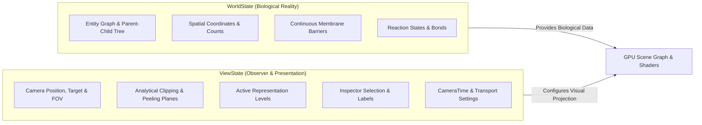
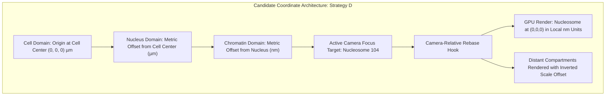

# Milestone 1: The Scale Spine — Design Specification

**Document Version:** 1.2.0-APPROVED-SPEC  
**Status:** Architectural Design — Approved in Principle (Corrections Incorporated)  
**Milestone Target:** Phase 1 Architectural Prototype  
**Scope:** Design Specification Only (No runtime implementation until approved)  

---

## Executive Summary

**Milestone 1 — The Scale Spine** tests the defining architectural problem of *The Seamless Cell*: **continuous biological scale-space**.

Rather than attempting to model complete metabolic or molecular mechanisms (such as ATP synthesis or transcription elongation), this milestone establishes an unbroken, mathematically stable, and biologically organized traversal from a whole mammalian cell down to atomic bonds.

The primary traversal spans a dynamic range of $2 \times 10^5$ ($200,000\times$) in physical scale:
$$\text{Mammalian Cell } (\sim 20\text{ }\mu\text{m} = 2 \times 10^{-5}\text{ m}) \longrightarrow \text{Chemical Bond } (\sim 0.1\text{ nm} = 10^{-10}\text{ m})$$
We reserve $\approx 10^6\times$ (one million-fold) for an extended traversal beginning around multicellular / tissue scale ($100\text{ }\mu\text{m}$).

This document specifies the intended user experience, the absolute separation of `WorldState` and `ViewState`, the temporal triad (`BiologicalTime`, `PlaybackTime`, `CameraTime`), the provisional chromatin scale hierarchy, coordinate-system candidate evaluations, the persistent biological identity model, representation/LOD dynamics, camera control, scientific metadata interfaces, provisional performance engineering targets, prototype acceptance tests, and unresolved scientific/visual inputs.

---

## 1. Intended User Experience & Traversal Path

The user begins in an expansive cellular environment observing an intact mammalian cell suspended in extracellular space.

```
                               THE SCALE SPINE TRAVERSAL
                               ─────────────────────────
[ 1. Mammalian Cell ] (~20 µm) [ASSUMPTION]
         │  Camera moves toward cell; ViewState analytical clipping peels plasma membrane
         ▼
[ 2. Cell Interior / Cytosol ] (~10 µm) [ASSUMPTION]
         │  Organelle crowding visible; camera approaches the nuclear envelope
         ▼
[ 3. Nucleus ] (~6 µm) [ASSUMPTION]
         │  ViewState sectioning opens nuclear envelope (Nuclear Pore is a future branch)
         ▼
[ 4. Chromosome Territory ] (~1 µm) [ASSUMPTION]
         │  Interphase chromosome boundary reveals internal chromatin organization
         ▼
[ 5. Local Chromatin Region ] (variable dimensions) [ASSUMPTION]
         │  Local chromatin clusters resolve (no discrete fixed-size compartments assumed)
         ▼
[ 6. Irregular Chromatin Polymer / Loop Segment ] [ASSUMPTION]
         │  Irregular polymer path (~11 nm bead diam; contour length & nucleosome count decoupled)
         ▼
[ 7. Nucleosome Core Particle ] (~11 nm) [ASSUMPTION]
         │  Individual histone octamer cylinder resolves with 1.67 turns of wrapped DNA
         ▼
[ 8. DNA Double Helix ] (~2 nm) [ASSUMPTION]
         │  Major and minor grooves of the B-form duplex emerge
         ▼
[ 9. Base-pair / Nucleotide Chemistry ] (~0.34 nm axial rise per bp) [ASSUMPTION]
         │  Complementary base rings, sugar-phosphate backbone (~0.34 nm is axial rise, not width)
         ▼
[ 10. Atomic / Chemical Representation ] (~0.1 nm) [ASSUMPTION]
         │  Space-filling CPK atomic spheres with covalent bond lengths
         ▼
[ Scale Minimum Reached: ~0.1 nm ]
```

### Core Experiential Tenets:
1. **Unbroken Spatial Continuity:** The user never experiences an abrupt cut, a scene reload, or an isolated diorama swap at $(0,0,0)$. Every smaller structure is visibly situated inside its parent container.
2. **Natural Scale Traversal:** As the observer zooms, zoom velocity adapts logarithmically to the current scale, allowing natural travel across microns and nanometers without disorienting acceleration.
3. **Persistent Biological Identity:** Clicking on a structure at any point in the traversal displays its persistent biological entity identity, position within the cellular hierarchy, and quantitative metadata in the Scientific Inspector.
4. **Non-Destructive Observation:** Peeling back or clipping through the plasma membrane or nuclear envelope is purely an optical sectioning operation in the observer's view (`ViewState.clippingPlanes`). In the simulation (`WorldState`), membranes remain unbroken physical barriers.

---

## 2. Separation of WorldState and ViewState

To guarantee that visualization and camera operations never distort biological reality, V2 enforces an absolute architectural separation between **`WorldState`** and **`ViewState`**:



### 1. `WorldState` (Biological Truth)
* **Definition:** The simulated physical state of the cell. Contains the entity registry, 3D metric coordinates, topological compartment containment, chemical concentrations, and physical membrane integrity.
* **Immutability by Observer:** Moving the camera, zooming, orbiting, enabling cross-section planes, or selecting objects *never* alters `WorldState`.
* **Compartment Logic:** A molecule inside the nucleus belongs to the `nucleoplasm` compartment in `WorldState`, regardless of whether the camera is viewing it from inside or outside the cell.

### 2. `ViewState` (Observer Operations)
* **Definition:** The parameters governing how `WorldState` is projected to the human observer at any given instant.
* **Scope:**
  * Camera spatial transform ($\vec{P}_{\text{cam}}, \vec{T}_{\text{focus}}, \text{FOV}$).
  * Analytical clipping planes (`clippingPlanes: THREE.Plane[]`) and dynamic angle cutaways.
  * Active representation level per entity (`entityActiveTier: Map<string, AbstractionTier>`).
  * Transparency overrides, depth peeling, and highlights.
  * Active UI overlays and inspector targets.
* **The Membrane Sectioning Principle:**
  * When the camera penetrates the plasma membrane or nuclear envelope, the visual opening is generated via `ViewState.clippingPlanes` or a custom depth-peeling shader.
  * In `WorldState`, the membrane remains an unbroken, continuous lipid bilayer maintaining its permeability barrier and electrochemical gradient. 
  * Slicing an envelope for visual inspection **must never** be modeled as biological membrane lysis or disruption.

---

## 3. The Temporal Triad: BiologicalTime, PlaybackTime, and CameraTime

To eliminate ambiguity between simulation speed, playback, and cinematic observer navigation, the engine formalizes three distinct clocks:

```
Clocks Overview:
─────────────────────────────────────────────────────────────────────────────
[ BiologicalTime (t_bio) ]   SI seconds. Represents true biochemical time.
                             (e.g., 10 ms enzymatic cycle, 20 min replication).
                             Advances ONLY when simulation is unpaused.

[ PlaybackTime (t_play) ]     Wall-clock seconds of active playback.
                             d(t_bio) / d(t_play) = kappa (biological scaling factor).

[ CameraTime (t_cam) ]       Wall-clock seconds of observer movement.
                             Drives camera interpolation, cinematic pans, and orbit.
                             ADVANCES INDEPENDENTLY of t_bio.
─────────────────────────────────────────────────────────────────────────────
```

### Governing Rule: Decoupling Observer Motion from Biological State
* **Cinematic movement of the observer ($t_{\text{cam}}$) must not advance biological state ($t_{\text{bio}}$) unless explicitly requested.**
* The user can pause biological time ($d t_{\text{bio}} / d t_{\text{play}} = 0$) and freely orbit, pan, or execute a continuous scale traversal from cell to DNA. The biological world remains frozen at that exact physical instant.
* Conversely, biological processes can play at variable speed ($\kappa$) while the camera remains completely stationary.

---

## 4. Provisional Scale Hierarchy & Metric Framework

> [!NOTE]
> **Provisional Chromatin Organization & Epistemic Status:**
> * Modern chromosome conformation capture (Hi-C) and cryo-electron tomography (cryo-ET) have overturned the classical textbook model of a uniform 30-nm solenoid/zigzag chromatin fiber in vivo.
> * Milestone 1 provisionally models interphase chromatin using a simplified structural hierarchy:  
>   `chromosome territory → local chromatin region → irregular chromatin polymer / loop segment → nucleosome → DNA`
> * **No discrete fixed-size objects:** Chromosome compartments, contact domains, or loop segments are irregular and dynamic. Formal A/B compartments, topologically associating domains (TADs), and specific cohesin/CTCF loops will be introduced from Chapter 5 specifications later.
> * **No fixed chain length:** We explicitly decouple:
>   1. **Local chromatin / polymer diameter** ($\sim 11\text{ nm}$ nucleosome bead diameter).
>   2. **Contour length** (curvilinear path length of the DNA/chromatin strand).
>   3. **Number of nucleosomes** (discrete stoichiometric count along the segment).  
>   We do **not** assign an arbitrary fixed physical length to a chromatin chain.
> * **Base-Pair Terminology:** $\sim 0.34\text{ nm}$ denotes the **B-DNA axial rise per base pair**, not total base-pair dimensions (duplex diameter is $\sim 2.0\text{ nm}$).
> * **All physical dimensions below are explicitly marked as `[ASSUMPTION]`** until validated ranges, species, and cell-type context are supplied by the Scientific Lead.
> * The primary Scale Spine does **not** force traversal through a nuclear pore complex; the nuclear pore is designated as a specialized future branch and inspection target.

| Tier | Provisional Biological Level | Nominal Dimension `[ASSUMPTION]` | Scale Order | Display Units | Provisional Representation Mode |
| :--- | :--- | :--- | :--- | :--- | :--- |
| **1** | **Mammalian Cell** | $\sim 20\text{ }\mu\text{m}$ | $10^{-5}\text{ m}$ | $\mu\text{m}$ | Smooth ellipsoidal membrane envelope with surface receptors |
| **2** | **Cell Interior / Cytosol** | $\sim 10\text{ }\mu\text{m}$ | $10^{-5}\text{ m}$ | $\mu\text{m}$ | Crowded cytoplasm with major organelle silhouettes |
| **3** | **Nucleus** | $\sim 6\text{ }\mu\text{m}$ | $10^{-6}\text{ m}$ | $\mu\text{m}$ | Double membrane envelope; nuclear pores visible on surface |
| **4** | **Chromosome Territory** | $\sim 1\text{ }\mu\text{m}$ | $10^{-6}\text{ m}$ | $\mu\text{m}$ | Volumetric territory envelope with internal sub-domain density |
| **5** | **Local Chromatin Region** | Variable `[ASSUMPTION]` | $10^{-7}\text{ m}$ | $\text{nm}$ | Local cluster of irregular chromatin loops; no fixed boundary shells |
| **6** | **Irregular Chromatin Polymer / Loop Segment** | Bead diam $\sim 11\text{ nm}$; contour length & nucleosome count decoupled | $10^{-8}\text{ m}$ | $\text{nm}$ | Irregular flexible polymer path of nucleosomes (no 30 nm fiber; no fixed chain length) |
| **7** | **Nucleosome Core Particle** | $\sim 11\text{ nm}$ diam, $5.7\text{ nm}$ height | $10^{-8}\text{ m}$ | $\text{nm}$ | Cylindrical histone octamer envelope wrapped by 1.67 turns of DNA |
| **8** | **DNA Double Helix** | $\sim 2\text{ nm}$ duplex diameter | $10^{-9}\text{ m}$ | $\text{nm}$ | B-form double helix with major and minor grooves |
| **9** | **Base-pair / nucleotide chemistry** | $\sim 0.34\text{ nm}$ axial rise/bp ($2.0\text{ nm}$ duplex diam) | $10^{-10}\text{ m}$ | $\text{\AA}$ / $\text{nm}$ | Purine-pyrimidine complementary base-pair rungs, ribose sugars, phosphate backbone ($\sim 0.34\text{ nm}$ is axial rise per bp, not total dimension) |
| **10** | **Atomic / Chemical Representation**| $\sim 0.1\text{ nm}$ bond lengths | $10^{-10}\text{ m}$ | $\text{\AA}$ / $\text{pm}$ | Space-filling CPK spheres with covalent bond cylinders |

---

## 5. Coordinate-System Candidate Implementation (Scale Spine Context)

The primary single-cell traversal spans a dynamic range of $2 \times 10^5$ ($200,000\times$) from mammalian cell ($20\text{ }\mu\text{m}$) to atomic chemistry ($0.1\text{ nm}$). We reserve $\approx 10^6\times$ for extended traversals beginning around tissue/multicellular scale ($100\text{ }\mu\text{m}$).



### Strategy Evaluation in Milestone 1:
1. **Primary Prototype (Strategy D):**
   * Compartments form a hierarchical tree in metric units.
   * As the camera focuses on a chromatin domain or nucleosome, that active sub-tree is rebased dynamically into camera-relative coordinates.
   * Molecular geometry (histones, DNA double helix) is rendered in native nanometers directly around the local origin, ensuring measurable screen-space stability ($\le 0.5\text{ px}$ vertex deviation under camera rotation).
2. **Fallback Verification (Strategy A):**
   * If nested rebasing introduces edge-case transform complexity, Strategy A (pure double-precision CPU subtraction + logarithmic depth buffer) will be evaluated side-by-side.

---

## 6. Biological Entity Identity Model

A nucleosome remains logically the same biological entity across all zoom levels. Crucially, **`activeRepresentationTier` does NOT belong to `BiologicalEntity`**. `BiologicalEntity` resides in `WorldState` and declares available representation tiers, but has zero knowledge of which tier the observer is viewing. Active tier selection is managed strictly by `ViewState` or a renderer-side `RepresentationController`.

```typescript
/**
 * Biological Entity Identity Model for Milestone 1
 */

export interface BiologicalEntity {
  readonly entityId: string;                 // Globally unique canonical ID
  readonly commonName: string;               // e.g. "Nucleosome Core Particle 104"
  readonly compartment: SpatialCompartment;  // e.g. "nucleoplasm"
  readonly parentEntityId: string | null;    // e.g. "chromatin_loop_07"
  readonly childEntityIds: string[];         // Constituent sub-entities
  
  // Metric Ground Truth (WorldState)
  readonly nominalDimensionsNm: {
    length?: number;
    diameter?: number;
    axialRiseNm?: number;                    // 0.34 nm for B-DNA axial rise per bp
    epistemicStatus: 'ASSUMPTION';           // Flagged until Scientific Lead supplies values
  };
  
  // Available Representation Tiers declared by Entity (WorldState does not track observer tier)
  readonly availableRepresentations: ReadonlySet<AbstractionTier>;
  
  // Epistemic Metadata
  readonly epistemicStatus: EpistemicStatus; // 'APPROVED' | 'EXTERNAL_VERIFIED' | 'ASSUMPTION'
  readonly specificationRef?: string;
}

/**
 * Renderer-side Representation Controller (ViewState)
 */
export interface ViewState {
  readonly camera: {
    position: THREE.Vector3;
    target: THREE.Vector3;
    fov: number;
  };
  readonly clippingPlanes: THREE.Plane[];    // ViewState sectioning only (never disrupts WorldState membranes)
  readonly cutawayAngle: number;
  readonly entityActiveTier: Map<string, AbstractionTier>; // Active LOD tier per entity ID
  readonly inspectorTargetEntityId: string | null;
  readonly clocks: {
    cameraTime: number;                      // t_cam: observer movement (never advances t_bio unless requested)
    playbackTime: number;                    // t_play: wall-clock elapsed playback
    playbackRate: number;                    // kappa scaling factor
  };
}

export interface RepresentationLevel {
  readonly tier: AbstractionTier;
  readonly visualObject: THREE.Object3D;
  readonly minScreenPixels: number;          // Activation threshold
  readonly maxScreenPixels: number;
  readonly isSymbolic: boolean;              // Explicit SYMBOLIC tag for particle/token representations
  
  update(dt: number, worldState: WorldState, viewState: ViewState): void;
  setVisible(visible: boolean, opacity: number): void;
  dispose(): void;
}
```

---

## 7. Representation / LOD Model & Semantic Transitions

To eliminate sudden popping, representation levels transition based on screenspace projected area with a $10\%$ hysteresis buffer.

> [!IMPORTANT]
> **Symbolic Representation & Shading Policy:**
> * Any schematic, particle, or token representation must be explicitly tagged **`SYMBOLIC`** in its metadata and in the Scientific Inspector.
> * **Do NOT use glow as a default indication of molecules, metabolites, ions, or activity.** Visual styling must remain physically motivated; glow and bloom are reserved exclusively for deliberate non-biological UI highlight cues.

| Traversal Step | Lower LOD Representation | Upper LOD Representation | Viewport Trigger |
| :--- | :--- | :--- | :--- |
| **Cell $\to$ Nucleus** | Opaque/textured plasma membrane | ViewState sectioned membrane revealing nucleus | Cell covers $> 75\%$ viewport |
| **Nucleus $\to$ Territory** | Intact nuclear envelope | ViewState sectioned envelope revealing chromosome territories | Nucleus covers $> 60\%$ viewport |
| **Territory $\to$ Local Region** | Territory boundary cloud | Clustered chromatin domain fiber bundles | Territory covers $> 40\%$ viewport |
| **Local Region $\to$ Polymer / Loop** | Clustered loop density | Individual anchored irregular polymer segment | Region covers $> 35\%$ viewport |
| **Polymer / Loop $\to$ Nucleosome** | Simplified bead chain (`SYMBOLIC`) | Histone octamer cylinder with wrapped DNA superhelix | Bead diameter $> 25\text{ pixels}$ |
| **Nucleosome $\to$ Helix** | Stylized DNA ribbon | B-form double helix with groove contours | DNA width $> 15\text{ pixels}$ |
| **Helix $\to$ Base-pair / Chemistry** | Continuous helical rungs | Base rings, ribose sugars, phosphate backbone | Rung width $> 10\text{ pixels}$ |
| **Base-pair / Chemistry $\to$ Atomic** | Flat geometric rings | Space-filling CPK atomic spheres with covalent bonds | Atom radius $> 8\text{ pixels}$ |

---

## 8. Camera Transition Model & Navigation Dynamics

### 1. Logarithmic Zoom Scaling
Camera velocity $\vec{v}_{\text{zoom}}$ is proportional to current distance from focus target $d = \|\vec{P}_{\text{cam}} - \vec{T}_{\text{focus}}\|$:
$$\vec{v}_{\text{zoom}} = \pm \alpha \cdot d \cdot \Delta t_{\text{cam}}$$
This ensures that zooming at the cell scale ($\sim 20\text{ }\mu\text{m}$) and zooming at the base-pair / nucleotide chemistry scale ($\sim 0.34\text{ nm}$ axial rise) feel identical in responsiveness.

### 2. ViewState Membrane Sectioning
* As the camera approaches within $1.2\times$ of the cell or nuclear radius, the front hemisphere is dynamically clipped by a camera-facing analytical plane (`THREE.Plane`).
* This permits smooth entry into internal compartments without membrane collisions or abrupt visual disappearances.
* In `WorldState`, membrane structures remain unbroken, continuous physical barriers.

---

## 9. Scientific Metadata Interface (Dual-View Architecture)

### Learner View (Default)
* Minimal, quiet, and cinematic.
* Subtle orientation widget in bottom-left.
* Minimal transport bar in bottom-center with biological timestamp and playback speed indicator.
* No permanent numbers or debug panels cluttering the visual field.

### Scientific / Dev Inspector Overlay
* Activated via `Tab` key or by clicking on any entity.
* Displays:
  * Persistent Entity ID and canonical name.
  * Hierarchical parent/child lineage.
  * Epistemic status badge (`[APPROVED]`, `[EXTERNAL_VERIFIED]`, or `[ASSUMPTION]`).
  * Real dimensions vs. display dimensions and exaggeration factors.
  * Active biological time ($t_{\text{bio}}$), playback time ($t_{\text{play}}$), and camera time ($t_{\text{cam}}$).
  * Active assumptions and simplifications.
  * GPU telemetry (FPS, draw calls, triangle count, memory).

---

## 10. Asset-Pipeline Requirements

### Canonical Scientific Data vs. Derived Render Assets
To prevent loss of scientific truth during graphic optimization, the asset pipeline strictly separates:
1. **CANONICAL SCIENTIFIC DATA:**
   * Authoritative, unmanipulated scientific sources: PDB/mmCIF atomic coordinate files (with accessions explicitly approved by the Scientific Lead), PubChem SDF chemical structures, cryo-ET density maps, and quantitative metrics from BioNumbers.
   * Stored in version-controlled data schemas or verified database accessions.
   * Never deformed, arbitrarily truncated, or modified to fit rendering engine constraints.
2. **DERIVED RENDER ASSETS:**
   * Artifacts generated from canonical scientific data for real-time visualization: glTF / GLB meshes, Draco-compressed geometry, decimated molecular surfaces (SES/SAS), cartoon/ribbon splines, instanced GPU attribute buffers, and normal/displacement maps.
   * Every derived asset retains a strict provenance hash and build script linking it back to its canonical source.
   * Regeneration is deterministic: if canonical coordinates are updated, derived assets are rebuilt automatically.

### Asset Production Workflows:
1. **Procedural Geometry Engines (TypeScript):**
   * **B-Form DNA Duplex Generator:** Generates mathematical double-helical paths, major/minor groove contours, and base-pair rungs.
   * **Irregular Chromatin Chain Generator:** Generates polymer paths for nucleosomes without imposing artificial 30-nm regular helical symmetry. Decouples local polymer diameter ($\sim 11\text{ nm}$ bead diameter), contour length, and discrete nucleosome count.
2. **Structural Mesh Assets (Blender $\to$ glTF):**
   * **Histone Octamer Core Envelope:** Stylized coarse-grained molecular surface representation.
   * **Nuclear Envelope Surface Shell:** Double-membrane section with embedded nuclear pore complex silhouettes.
3. **Strict Structural Data Policy:**
   * **Zero unverified PDB downloads.** No atomic PDB or mmCIF coordinate files will be downloaded or integrated without explicit accession approval from the Scientific Lead.

---

## 11. Provisional Performance Engineering Targets (Benchmark: MacBook Pro)

All metrics below represent **provisional engineering targets**. Triangle counts and draw call limits alone do not guarantee performance; actual performance acceptance will be benchmarked empirically on the project MacBook Pro.

| Metric | Provisional Engineering Target | Rationale |
| :--- | :--- | :--- |
| **Target Framerate** | **60 FPS** ($\le 16.6\text{ ms}$) | Fluid spatial interaction is essential for scale comprehension. |
| **Peak Triangle Count** | $\le 300,000\text{ triangles}$ (provisional target) | Conservative budget to preserve vertex processing bandwidth on unified memory architectures. |
| **Peak Draw Calls** | $\le 80\text{ draw calls/frame}$ | Enforced via instancing and batching. |
| **Peak GPU Memory** | $\le 120\text{ MB}$ | Preserves head-room for subsequent chapters. |
| **Garbage Collection (GC)** | **0 allocations in tick** | Pre-allocated scratch vectors and matrices. Zero `new` in `update()`. |

---

## 12. Prototype Acceptance Tests

Milestone 1 will be considered complete when the following tests pass:

1. **Continuous Scale Traverse:** Unbroken zoom from whole cell ($20\text{ }\mu\text{m}$) to chemical bond ($0.1\text{ nm}$) ($2 \times 10^5$, $200,000\times$) and back without camera clipping or scene resets.
2. **Measurable Screen-Space Stability:** At base-pair and atomic scales, stationary vertices exhibit sub-pixel deviation ($\le 0.5\text{ px}$) across full $360^\circ$ camera orbit and rotation, eliminating visible floating-point swim or vertex jitter.
3. **Biological Identity Preservation:** Clicking a nucleosome at chromatin scale and at atomic scale resolves the exact same canonical `entityId` and provenance record.
4. **Hysteresis Stability:** Holding the camera near representation boundaries produces zero visual flickering.
5. **ViewState vs WorldState Integrity:** Sectioning through the plasma membrane or nuclear envelope operates purely as a `ViewState` clipping plane without altering biological compartment state.
6. **Clock Decoupling:** Pausing biological time allows full 3D camera navigation and scale traversal while the biological scene remains frozen.
7. **Empirical Performance Standard:** Sustained $\ge 60\text{ fps}$ during continuous zoom on the target MacBook Pro.

---

## 13. Unresolved Scientific Inputs

*(To be supplied incrementally by the Scientific Lead)*

1. **Cell Type Baseline:** Approved model cell type (e.g., human diploid fibroblast).
2. **Nuclear Dimensions:** Verified nuclear diameter, envelope thickness, and nuclear lamina organization.
3. **Chromatin Architecture:** Approved compaction parameters for interphase chromatin domains; verified nucleosome repeat length (NRL).
4. **Histone Structure:** Approved PDB/mmCIF reference structure for the human nucleosome core particle.
5. **DNA Helical Parameters:** Validated rise per base pair ($0.34\text{ nm}$), pitch ($10.5\text{ bp/turn}$), and diameter ($2.0\text{ nm}$).

---

## 14. Unresolved Visual Inputs

*(To be aligned with the Human Project Lead)*

1. **Chromatin Domain Aesthetics:** Color palette for chromosome territories (contrasting identification hues vs. epigenetic functional coloring).
2. **Nucleoplasm Optical Density:** Transparent clean aesthetic vs. subtle macromolecular depth haze.
3. **Membrane Sectioning Style:** Planar geometric clipping cutaway vs. smooth angle-of-incidence Fresnel transparency peeling.

---

*End of Milestone 1 Design Specification (Revision 1.2.0-APPROVED-SPEC).*  
*Next step: Commit and push architecture documents to remote GitHub repository.*
