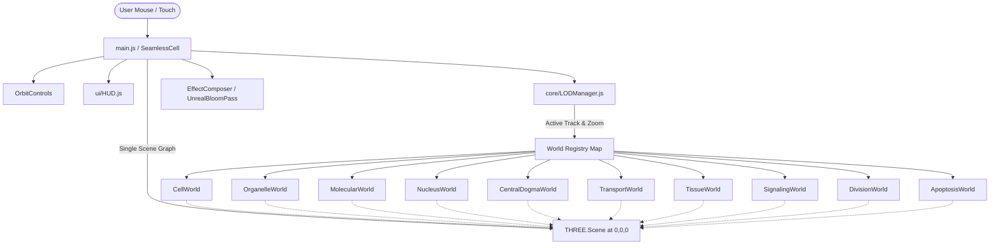
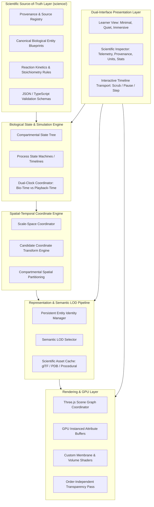
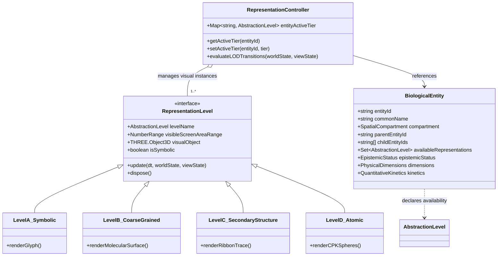
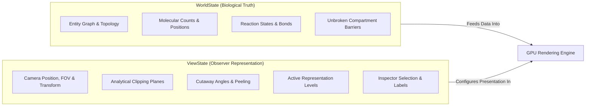
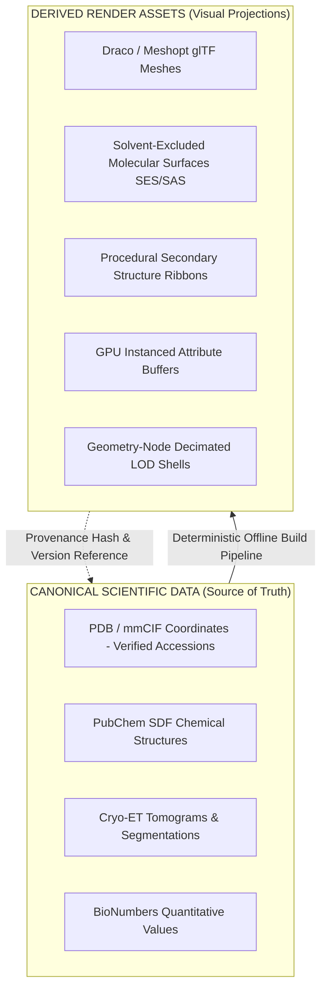

# The Seamless Cell V2: Architecture Audit & System Specification

**Document Version:** 2.1.0-REVISED (Phase 0 Audit)  
**Status:** Architectural Specification — Under Human Review  
**Target System:** The Seamless Cell V2  
**Reference Codebase:** `https://github.com/thisizkavi-lab/the-seamless-cell`  

---

## Executive Summary

*The Seamless Cell* is envisioned as a spatial, temporal, quantitative, and interactive 3D representation of cell biology as one continuous physical world, structured pedagogically around the 20 chapters of *Essential Cell Biology* (6th Edition) and constrained by *BioNumbers* quantitative data.

The current repository is an early exploratory prototype. While it demonstrates strong visual enthusiasm across five core tracks, it functions as a collection of disconnected procedural dioramas. It relies on camera-distance optical illusions, $(0,0,0)$ spatial teleportation, unphysical modulo sine-wave loops, hardcoded geometric primitives, and zero separation between biological state and GPU rendering.

This revised audit forensically analyzes the existing prototype, classifies every subsystem for salvage or replacement, details fundamental architectural shortcomings, formalizes candidate architectures for continuous scale-space, and defines the structural framework for **The Seamless Cell V2**.

---

## ⚠️ Epistemological Guardrails & Authority Protocol

> [!IMPORTANT]
> **Authoritative Knowledge Boundary & Disclaimer:**
> 1. The AI implementation agent **does not possess direct access** to *Essential Cell Biology* (6th Edition) or *Cell Biology by the Numbers*.
> 2. The agent **must not** pretend to have read them or reconstruct biological mechanisms from memory and silently use them as project truth.
> 3. All authoritative biological specifications will be provided incrementally by the project's human scientific lead.
> 4. Phase 0 is strictly **architectural design**. It does not implement biological mechanisms or assert textbook facts.

### The Initial Audit Case Study: PDB 6TBM
In the initial proposal draft, the agent proposed PDB `6TBM` as an ATP synthase structure. In reality, `6TBM` is the cryo-EM structure of the yeast SAGA complex bound to TBP (TATA-binding protein). 

This concrete error demonstrates the necessity of the project's core epistemological rule:
* **Never select biological structures, numerical values, mechanisms, species assumptions, or molecular identities from model memory and mark them as verified.**
* A database identifier or quantitative value must actually be queried and its metadata validated by the human scientific lead before receiving verified status.

### The Three-Tier Biological Epistemic Classification

Every biological claim, physical dimension, kinetic rate, concentration, stoichiometry, and mechanism in V2 must be tagged with one of three explicit categories:

1. **`APPROVED`**: Explicitly supplied and verified in the project's official science specifications by the scientific lead.
2. **`EXTERNAL_VERIFIED`**: Obtained from an explicitly approved scientific database or literature source (e.g., RCSB PDB, UniProt, verified BioNumbers accession) with exact citations validated.
3. **`ASSUMPTION`**: An implementation choice, working hypothesis, heuristic, visual approximation, or placeholder not yet scientifically approved.

**Cardinal Rule:** The software must never silently convert an `ASSUMPTION` into biological truth merely because it produces a visually appealing or computationally convenient animation. All assumptions must be exposed in metadata, visible in the Scientific Inspector, and tracked for future human review.

---

## A. Current Repository Audit

### 1. Architectural Map

```
the-seamless-cell/
├── index.html                  # Single canvas container, loads src/main.js
├── package.json                # Dependencies: three (0.183.2), vite (8.0.4)
├── package-lock.json
├── README.md                   # Conceptual overview of tracks & visual guide
├── public/
│   ├── favicon.svg
│   └── icons.svg
└── src/
    ├── main.js                 # Monolithic orchestrator: Three.js bootstrap, camera, composer, tick
    ├── core/
    │   └── LODManager.js       # Discrete zoom ranges, track world dispatcher, opacity lerper
    ├── ui/
    │   └── HUD.js              # DOM HUD: Zoom slider, track buttons, static text cards
    ├── utils/
    │   └── constants.js        # Color hex codes, track definitions, math helpers
    └── worlds/                 # 10 Independent Three.js Scene Groups
        ├── CellWorld.js        # Whole-cell overview (membranes, organelles, vesicles)
        ├── OrganelleWorld.js   # Mitochondrion interior (cristae, ETC, proton particle swarm)
        ├── MolecularWorld.js   # ATP Synthase rotary turbine (c-ring, stalk, F1 head)
        ├── NucleusWorld.js     # Nuclear envelope, pores, chromatin curves, RNA Pol
        ├── CentralDogmaWorld.js# DNA transcription (left) + Ribosome translation (right)
        ├── TransportWorld.js   # Rough ER, Golgi stack, microtubule tracks, exocytosis
        ├── TissueWorld.js      # 5 epithelial cells in a row, paracrine signal diffusion
        ├── SignalingWorld.js   # GPCR, G-protein split, adenylyl cyclase, cAMP burst, PKA, TF
        ├── DivisionWorld.js    # 60s mitotic cell cycle with cyclins/cdks & cohesin cleavage
        └── ApoptosisWorld.js   # 15s extrinsic apoptosis cascade (FasL/DISC to blebbing)
```



---

### 2. Detailed Module Breakdown

#### `src/main.js` (284 lines)
* **Responsibilities:** Application entry point. Instantiates `THREE.WebGLRenderer`, `THREE.PerspectiveCamera`, `THREE.Scene`, `OrbitControls`, `EffectComposer` (with `RenderPass` and `UnrealBloomPass`), `LODManager`, `HUD`, and all 10 `World` instances.
* **Camera Control:** Disables `OrbitControls` zoom and intercepts window wheel/touch events to mutate a normalized `targetZoom` scalar $\in [0.05, 0.98]$. Interpolates actual `zoomValue` using `lerp(zoomValue, targetZoom, 0.06)`.
* **Zoom to Distance Mapping:** Uses a hardcoded piecewise linear lookup table:
  * Zoom `0.0` (Tissue) $\to$ Distance `35`, FOV `50°`
  * Zoom `0.3` (Cell) $\to$ Distance `18`, FOV `48°`
  * Zoom `0.6` (Organelle) $\to$ Distance `16`, FOV `42°`
  * Zoom `1.0` (Molecular) $\to$ Distance `8`, FOV `30°`
* **Defects & Fragility:**
  * Total dynamic range of camera distance is only $35 / 8 = 4.375\times$. In reality, the scale transition from a whole cell ($20\text{ }\mu\text{m}$) to the chemical bond ($0.1\text{ nm}$) is $2 \times 10^5$ ($200,000\times$). Extending to multicellular tissue scale ($100\text{ }\mu\text{m}$) reaches a dynamic range of $\approx 10^6\times$ (one million-fold).
  * Camera always looks directly at $(0,0,0)$.
  * Every world is instantiated at initialization and added simultaneously to `this.scene`, regardless of track or zoom level.

#### `src/core/LODManager.js` (135 lines)
* **Responsibilities:** Manages world visibility and crossfades based on normalized `zoomValue` and selected `activeTrack`.
* **Mechanism:** Divides zoom space into four static intervals: `tissue` ($-0.1 \to 0.21$), `cell` ($0.12 \to 0.48$), `organelle` ($0.42 \to 0.78$), `molecular` ($0.72 \to 1.1$). In each tick, calculates `opacity = smoothstep(min, min + fw, z)` and calls `world.setOpacity(opacity)` and `world.update(dt, zoomValue)`.
* **Defects & Fragility:**
  * Pure opacity crossfading. There is no hierarchical LOD or spatial nesting. When transitioning from whole-cell to organelle, the cell does not reveal interior structures; rather, the whole cell fades out while an independent, unscaled organelle diorama fades in at $(0,0,0)$.
  * Inactive worlds retain all allocated GPU geometries, textures, and CPU memory.

#### `src/ui/HUD.js` (427 lines)
* **Responsibilities:** Injects raw HTML and CSS into the DOM for a track selector, vertical zoom slider, level indicator, and informational card.
* **Defects & Fragility:**
  * Monolithic DOM string injection coupled directly to global state.
  * Static string dictionary (`info[track][level]`) with hardcoded text. No connection to dynamic simulation state.
  * No timeline controls (play, pause, scrub, step, speed) and no scientific telemetry.

#### `src/utils/constants.js` (197 lines)
* **Responsibilities:** Global color dictionary (`COLORS`), track structure definitions (`TRACKS`), zoom boundary thresholds (`ZOOM`), and scalar math helpers.
* **Defects & Fragility:**
  * Colors are purely aesthetic, high-saturation hex values (`0xFF1744`, `0x76FF03`, `0x00E5FF`). They do not represent physical properties (CPK standard, hydrophobicity, electrostatic potential).
  * Math helpers use unseeded `Math.random()`, preventing deterministic playback, testing, or reproducible state scrubbing.

#### `src/worlds/*` (10 World Implementations, ~3,500 lines total)
* **`CellWorld.js`:** Procedural whole cell with `IcosahedronGeometry(10, 4)` membrane, capsule mitochondria, tube ER, instanced sphere vesicles (random walk), and lines radiating from $(2.5, 0.5, 0)$ as microtubules.
* **`OrganelleWorld.js`:** Mitochondrion interior with concentric spheres ($R=8.0$ outer, $R=6.5$ inner) and 8 torus cristae. 100 proton particles bounce inside the intermembrane shell via simple bounding inversions.
* **`MolecularWorld.js`:** Isolated ATP Synthase diorama: flat box membrane slab, 10-cylinder F0 rotor, central cylinder $\gamma$-stalk, and 6-sphere $\alpha_3\beta_3$ F1 catalytic head. Rotates at an arbitrary $2\text{ rev/s}$. Protons spiral down a hardcoded path; ATP octahedra pop into existence and drop.
* **`NucleusWorld.js`:** Concentric spheres ($R=8.0$ outer, $R=7.6$ inner) with 24 torus nuclear pores. 12 Catmull-Rom tube curves represent chromatin. 8 RNA Polymerase spheres move along curve parameter $t$ leaving dynamic line trails.
* **`CentralDogmaWorld.js`:** Dual diorama: Left shows transcription (intertwined helical tube DNA, sphere RNA Pol, torus spliceosome). Right shows translation (mRNA tube, 3 polyribosomes with L-shaped tRNAs cycling through A/P/E sites, and an instanced alpha-helix polypeptide chain).
* **`TransportWorld.js`:** Rough ER rendered as 3 undulating planes, 4 cylinder Golgi cisternae with color gradient, 6 Catmull-Rom microtubule tracks, and instanced vesicles whose wireframe coats dissolve at $t > 0.3$.
* **`TissueWorld.js`:** 5 ellipsoid cells positioned along the x-axis. Center cell emits 40 instanced signal particles radially; surface cylinder "receptors" pulse emissive intensity upon proximity.
* **`DivisionWorld.js`:** 60-second linear timeline driven by modulo `time % 60`. Features 4 sister chromatid pairs, spindle microtubules, separating centrosomes, cohesin links, and cyclin/cdk indicator boxes.
* **`ApoptosisWorld.js`:** 15-second linear timeline driven by modulo `time % 15`. Models extrinsic pathway: FasL dodecahedron docks Fas trimer $\to$ FADD docks $\to$ active Caspase-8 scissor blades animate $\to$ Bid cleaves $\to$ Bax/Bak pores form $\to$ Cytochrome c leaks $\to$ Apoptosome forms $\to$ Caspase-3 activates $\to$ cell shrinks and blebs.

---

### 3. Current Rendering Pipeline
1. **Renderer:** `THREE.WebGLRenderer` configured with `antialias: true`, `powerPreference: 'high-performance'`, `ACESFilmicToneMapping` (exposure `1.2`), and clear color `#0a0a12`.
2. **Post-Processing:** `EffectComposer` running `RenderPass` followed by `UnrealBloomPass` (strength `0.4`, radius `0.6`, threshold `0.7`).
3. **Transparency & Depth Sorting Issues:**
   * Almost all membranes use `MeshPhysicalMaterial` or `MeshStandardMaterial` with `transparent: true`, `opacity: 0.1 – 0.4`, `side: THREE.DoubleSide`, and `depthWrite: false`.
   * Disabling `depthWrite` avoids standard z-buffer clipping for transparent objects, but creates severe draw-order sorting artifacts: back faces and internal structures frequently render in front of foreground membranes depending on camera orientation.

---

### 4. Current Zoom / LOD System
* **Scalar-Driven Crossfade:** The entire scale transition is parameterized by a single scalar $z \in [0, 1]$.
* **Optical Illusion:** The camera does not move closer to an object situated inside a larger context. Instead, the camera stays between distance $8$ and $35$ from the origin, while the scene contents at $(0,0,0)$ are swapped out via linear opacity fades.
* **Scale Discontinuity:** The whole cell in `CellWorld` has a radius of $10$ units. The mitochondrion in `OrganelleWorld` has a radius of $8$ units. The ATP synthase in `MolecularWorld` has a diameter of $\sim 3$ units. In reality, a cell ($20\text{ }\mu\text{m}$) is $20\times$ larger than a mitochondrion ($1\text{ }\mu\text{m}$), which is $100\times$ larger than ATP synthase ($10\text{ nm}$). In the prototype, all three occupy nearly identical screen coordinate extents ($\sim 15$ Three.js units).

---

### 5. Current Animation Model
* **Mechanism:** Every active world implements an `update(dt, zoomValue)` method called synchronously inside the main `requestAnimationFrame` loop.
* **Loop Implementation:** Animations are driven entirely by `this.time += dt` combined with:
  1. `Math.sin(this.time * freq)` for oscillation and wobbling.
  2. Modulo phase tracking: `(this.time % cycleLength) / cycleLength` with cascading `if (p < 0.1) ... else if (p < 0.2)` conditionals.
  3. Continuous Euler integration: `pos.addScaledVector(vel, dt)` with manual bounding box or bounding sphere bounce checks.
* **Defects:** Completely uncoupled from physical or biological time units. Non-scrubbable and non-reversible. You cannot seek to an exact timestamp or play backwards.

---

### 6. Current Asset Approach
* **Zero External Data:** The repository contains zero external biological files. There are no `.pdb`, `.cif`, `.gltf`, `.glb`, `.obj`, `.mol`, or `.sdf` files.
* **100% Procedural Primitives:** Every biological structure is constructed on CPU startup using Three.js built-in geometric primitives (spheres, cylinders, boxes, tubes).
* **Labels:** Procedural HTML5 2D canvas contexts drawing white text onto transparent backgrounds, converted to `THREE.CanvasTexture` and mapped to `THREE.Sprite`.

---

### 7. Current Performance Assumptions
* **CPU-Side Instancing:** Extensively utilizes `THREE.InstancedMesh`. However, transformation matrices are calculated on the CPU every frame using `THREE.Matrix4` / `THREE.Object3D` scratch dummies and uploaded to the GPU via `instanceMatrix.needsUpdate = true`.
* **Memory Allocations in Inner Loops:** Methods frequently call `new THREE.Vector3()`, `clone()`, and array slicing inside per-frame particle loops, triggering constant Garbage Collection (GC) pauses.
* **Geometry Count:** Total polygon count across any single active world is modest ($< 150,000$ triangles), which maintains 60 fps on an Apple M-series GPU, but this is achieved only because the biological models are drastically oversimplified primitives.

---

## B. Salvage Assessment

| Subsystem / Module | Prototype File | Status | Technical Rationale & Salvage Value |
| :--- | :--- | :--- | :--- |
| **Main Engine Loop** | `src/main.js` | **REPLACE** | Monolithic class mixing renderer setup, DOM event binding, camera table interpolation, and world ticking. Replace with decoupled application lifecycle. |
| **Zoom & Scale System** | `src/core/LODManager.js` | **REPLACE** | Relies on scalar crossfades of isolated models at $(0,0,0)$. Cannot represent continuous nested coordinate frames or true physical scale transitions. |
| **HUD & UI Layer** | `src/ui/HUD.js` | **REPLACE** | Monolithic DOM string injection. Lacks timeline transport controls, dynamic telemetry, quantitative unit readouts, and provenance badges. Must be split into Learner View and Scientific Inspector. |
| **Color Constants** | `src/utils/constants.js` | **REFACTOR** | Rich aesthetic starting point, but hex codes must be refactored into semantic biological styling tokens (CPK, hydrophobicity, electrostatic, fluid membrane identity). |
| **Math Helpers** | `src/utils/constants.js` | **REFACTOR** | `lerp`, `clamp`, and `smoothstep` are standard, but random helpers (`rand`, `randomInSphere`) must be replaced with seeded pseudo-random number generators (PRNG) for deterministic state scrubbing. |
| **10 Scene Worlds** | `src/worlds/*.js` | **REPLACE** | Disconnected dioramas using primitive shapes and modulo loops. Their sequential biochemical logic (GPCR cascade, apoptosis choreography) will be salvaged as narrative blueprints for formal state machines. |
| **Build Setup** | `package.json`, Vite | **KEEP (EXPAND)** | Vite is fast, modern, and well-suited. Needs expansion for TypeScript, GLSL shader support, and automated test runners. |

---

## C. Fundamental Shortcomings

### 1. Biology / State Separation
In the current code, biological state is inextricably conflated with visual rendering:
```javascript
// Current prototype (SignalingWorld.js):
else if (p < 0.35) {
  const t = (p - 0.2) / 0.15;
  this.gAlpha.position.x = lerp(0, 3, t);
  this.gdpIndicator.material.color.setHex(0x00E676); // GDP→GTP
}
```
The nucleotide exchange reaction does not exist as an entity or state property. It exists only as a mesh coordinate translation and a hardcoded material color swap.

**V2 Requirement:** The biological system must be modeled as an explicit state model. The renderer merely inspects the state of the entity (`gAlpha.boundNucleotide === 'GTP'`) and maps it to appropriate visual representations, animations, and shaders.

### 2. The Scale Fallacy
The prototype handles scale by shrinking and expanding camera distance between $35$ and $8$ Three.js units, swapping entire worlds at $(0,0,0)$. 
* **Dynamic Range Failure:** A mammalian cell ($\sim 20\text{ }\mu\text{m} = 2 \times 10^{-5}\text{ m}$) and a chemical bond ($\sim 0.1\text{ nm} = 10^{-10}\text{ m}$) span a dynamic range of $2 \times 10^5$ ($200,000\times$). Traversal beginning around multicellular / tissue scale ($100\text{ }\mu\text{m} = 10^{-4}\text{ m}$) extends this to $\approx 10^6\times$ (one million-fold). A single standard WebGL float32 depth buffer cannot span this range without catastrophic z-fighting or near-plane clipping.
* **Spatial Disconnection:** Zooming in does not penetrate the surface of an existing cell; it crossfades into an unrelated floating object. The user never builds an intuition for spatial containment.

### 3. Time, Causality, and Scrubbing
* **Unconstrained Modulo Clocks:** Every animated world runs on `(this.time % cycleLength) / cycleLength`. The cell cycle in `DivisionWorld` restarts every 60 seconds indefinitely. Apoptosis kills the cell and then snaps back into a pristine cell every 15 seconds.
* **No Temporal Scaling:** A cell cycle takes $\sim 24\text{ hours}$ in mammalian fibroblasts; the prototype renders it in $60\text{ seconds}$ (speedup: $\sim 1440\times$). The software has no internal awareness of these scaling factors.
* **No Scrubbing or Pausing:** Because animations mutate positions in place using delta-time accumulations and unseeded random numbers, dragging a timeline slider backward is mathematically impossible without resetting the world.

### 4. Spatial Continuity and Compartment Logic
In reality, a cell is organized into topology-preserving compartments (Cytosol, Nucleoplasm, ER Lumen, Golgi Cisternae, Mitochondrial Matrix, Intermembrane Space, Extracellular Space). In the prototype, molecules exist in global coordinate space and are kept inside the cell via simple Euclidean distance clamping. Molecules have no awareness of biological membranes as physical barriers.

### 5. Data Provenance and Quantitative Metadata
There is zero biological provenance in the repository. Particle counts, concentrations, dimensions, and rates are arbitrary magic numbers. Without a structured metadata layer linked to authoritative scientific databases and literature, visual choices cannot be defended scientifically.

### 6. Chapter Composition vs. Siloed Universes
The prototype divides biology into five isolated tracks. In `CellWorld`, ribosomes are static brown dots. In `CentralDogmaWorld`, ribosomes are large animated machines. In `TransportWorld`, ribosomes are green beads stuck to planes. A chapter should act as a pedagogical filter or lens that reveals specific components of the continuous cell, rather than booting up a completely different diorama.

### 7. Asset Architecture and Molecular Realism
All macromolecular assemblies are constructed from primitive geometric meshes. Reducing RNA Polymerase II to a single yellow sphere obscures its real mechanism (DNA entry cleft, active site $\text{Mg}^{2+}$, RNA exit channel, transcription bubble). The prototype cannot import or parse standard scientific data formats (PDB, mmCIF, AlphaFold CIF, PubChem SDF).

### 8. Performance, Memory, and Garbage Collection
Creating new `THREE.Vector3` instances in inner update loops generates substantial GC pressure. While `InstancedMesh` is used, matrices are recalculated on the CPU every frame and re-uploaded over the bus.

### 9. Testability and Verification
The existing codebase contains zero unit, integration, or visual regression tests. World classes depend directly on WebGL context availability and DOM state, making automated continuous integration testing impossible.

---

## D. Proposed V2 Architecture

To fulfill the vision of a continuous, quantitative, multi-scale representation of cell biology, The Seamless Cell V2 decouples biological modeling from graphical rendering.



---

### 1. Scientific Source-of-Truth Layer: Repository Structure

To ensure that scientific truth is maintained independently of 3D rendering code, V2 adopts a dedicated `science/` directory tree:

```
the-seamless-cell/
├── science/
│   ├── schemas/                # JSON Schema & TypeScript definitions for all biological data
│   │   ├── entity.schema.json
│   │   ├── process.schema.json
│   │   ├── provenance.schema.json
│   │   └── quantitative.schema.json
│   ├── entities/               # Canonical entity definitions (one JSON file per entity)
│   │   ├── macromolecules/
│   │   ├── small_molecules/
│   │   └── complexes/
│   ├── processes/              # State-machine and kinetic definitions
│   │   ├── central_dogma/
│   │   ├── cell_cycle/
│   │   └── transport/
│   ├── chapters/               # Chapter lens configurations (ECB Chapters 1 - 20)
│   ├── quantitative/           # Validated quantitative constraints
│   └── sources/                # Registry of cited literature, databases, and specifications
```

#### Standard Factual Field Schema
Every quantitative or factual assertion in `science/` must support the following structure:

```typescript
export interface QuantitativeField<T = number> {
  value: T;
  unit: string;                       // SI or standard scientific unit (e.g. "nm", "s", "rev/s", "uM")
  context: string;                    // Experimental or physiological conditions
  species?: string;                   // Organism (e.g. "Homo sapiens", "Saccharomyces cerevisiae")
  cellType?: string;                  // e.g. "HeLa", "Cardiomyocyte", "Fibroblast"
  provenanceStatus: EpistemicStatus;  // 'APPROVED' | 'EXTERNAL_VERIFIED' | 'ASSUMPTION'
  source: {
    type: 'PROJECT_SPEC' | 'LITERATURE_DOI' | 'BIONUMBERS' | 'DATABASE_ENTRY' | 'MODEL_HEURISTIC';
    identifier: string;               // Spec section, DOI, BNID, or accession
    citation?: string;
  };
  uncertaintyRange?: {
    min: T;
    max: T;
    confidenceInterval?: string;
  };
  notes?: string;                     // Explanatory rationale or documented simplifications
}
```

---

### 2. Biological Identity vs. Representation Level

A foundational requirement of V2 is that **biological identity must survive representation changes**. 

A nucleosome does not cease to exist when the camera zooms out to the chromosome scale; it simply changes its visual representation. If the user clicks on that region of the chromosome in the Scientific Inspector, the engine must know which nucleosomes and genes reside within that density.



* **`BiologicalEntity` (WorldState Ground Truth)**: The persistent logical object. Carries canonical identity, biological parent/child relationships, state machine variables, and quantitative metadata. It is never destroyed during zoom transitions. Crucially, **`activeRepresentationTier` does NOT belong to `BiologicalEntity`**. `BiologicalEntity` declares available representation tiers (`availableRepresentations: ReadonlySet<AbstractionLevel>`), but has zero knowledge of which representation the observer is viewing.
* **`RepresentationController` / `ViewState` (Observer Operations)**: Active representation selection belongs strictly to `ViewState` (e.g., `entityActiveTier: Map<string, AbstractionLevel>`) and is evaluated dynamically by the renderer-side `RepresentationController` based on camera distance, screen-space footprint, and user preferences.
* **`RepresentationLevel`**: The visual manifestation of an entity at a specific scale (`Level A: Symbolic/Density`, `Level B: Coarse Envelope`, `Level C: Secondary Structure Ribbon`, `Level D: Atomic CPK`).
* **Symbolic Tagging & Glow Policy**:
  * Any schematic, token, or particle-swarm representation (such as `LevelA_Symbolic`) must be explicitly tagged **`SYMBOLIC`** in its metadata and inspector telemetry.
  * **Do NOT use glow as a default indication of molecules, metabolites, ions, or activity.** Shading must remain physically motivated. Visual glow, neon bloom, and chromatic fringes are banned as indicators of biological state and are reserved strictly for deliberate, non-biological UI highlight cues.
* **Transition Logic**: As screenspace projected area changes, the `RepresentationController` crossfades or swaps representation levels while preserving the underlying pointer to the `BiologicalEntity`. Raycasting/picking always resolves to the persistent `BiologicalEntity`, regardless of which visual LOD was hit.

---

### 3. Dual-Interface Architecture: Learner View vs. Scientific Inspector

To resolve the tension between immersive educational visualization and rigorous scientific instrumentation, V2 defines two distinct interface planes:

```
┌────────────────────────────────────────────────────────────────────────┐
│ [≡ Menu]                   LEARNER VIEW                  [Track: Dogma] │
│                                                                        │
│                                                                        │
│                      (Uncluttered, Immersive 3D)                        │
│                 No permanent HUD clutter or raw numbers                 │
│                                                                        │
│                                                                        │
│ ┌────────────────────────────────────────────────────────────────────┐ │
│ │ [◀◀] [▶ Play] [▶▶] ───●──────────────────────── [Speed: 1x (Real)] │ │
│ └────────────────────────────────────────────────────────────────────┘ │
└────────────────────────────────────────────────────────────────────────┘
                                    │
                                    ▼ Toggle Inspector (Hotkey / Click)
┌────────────────────────────────────────────────────────────────────────┐
│ SCIENTIFIC / DEV INSPECTOR OVERLAY                    [Status: ACTIVE] │
├───────────────────────────────────┬────────────────────────────────────┤
│ ENTITY TELEMETRY                  │ PROVENANCE & QUANTITATIVE DATA     │
│ ID: nuc_core_histone_octamer_042  │ Status: [EXTERNAL_VERIFIED]        │
│ Compartment: Nucleoplasm          │ PDB Source: [Pending Query Validation]│
│ Biological Parent: Chromatin Loop 3│ BioNumbers: BNID [Pending]         │
├───────────────────────────────────┼────────────────────────────────────┤
│ SPATIAL & SCALE METRICS           │ TEMPORAL METRICS                   │
│ Real Diameter: 11.0 nm            │ Biological Clock: 00:04:12.450     │
│ Visual Exaggeration: 1.0x (None)  │ Playback Speedup: 1.0x             │
│ World Position: [x, y, z] (nm)    │ State: Elongation Phase            │
├───────────────────────────────────┼────────────────────────────────────┤
│ ACTIVE ASSUMPTIONS & SIMPLIFICATIONS:                                  │
│ - Histone tail flexible conformations approximated via rigid envelope. │
│ - Linker DNA length set to standard 147 bp wrap + 20 bp linker.        │
└────────────────────────────────────────────────────────────────────────┘
```

1. **Learner View:** Minimal, visually quiet, and atmospheric. Displays only essential pedagogical cues (subtle orientation indicator, minimal transport scrubber, elegant chapter titles).
2. **Scientific / Dev Inspector:** Activatable via inspection click or developer hotkey. Renders complete quantitative telemetry, provenance badges, physical dimensions vs display dimensions, scale exaggeration factors, biological vs playback timestamps, active assumptions, and real-time GPU performance diagnostics.

---

### 4. Separation of WorldState and ViewState

A foundational architectural requirement for V2 is the absolute separation between **biological ground truth (`WorldState`)** and **observer-driven presentation (`ViewState`)**:



* **`WorldState` (Biological Reality):**
  * Holds the ground truth of the biological system: entity registry, spatial positions, molecular counts, concentrations, reaction states, covalent and non-covalent bond topologies, and membrane barrier integrity.
  * **Immutable by Observer Actions:** Moving the camera, zooming, panning, or enabling visual inspection tools *never* alters `WorldState`.
  * Preserves topological containment: a molecule inside the nucleus remains in the `nucleoplasm` compartment regardless of where the observer is looking.

* **`ViewState` (Observer & Presentation):**
  * Governs how `WorldState` is presented to the user: camera orientation, camera focal length/FOV, active representation levels (LOD), analytical clipping planes, opacity overrides, semantic cross-sections, highlighted pathways, and labels.
  * **Critical Example (Membrane Peeling / Sectioning):** Slicing or clipping through the plasma membrane or nuclear envelope to inspect internal organelles is strictly a `ViewState` operation (e.g., `ViewState.clippingPlanes` or `ViewState.cutawayAngle`). In `WorldState`, the membrane remains an intact, continuous physical lipid bilayer with unbroken permeability and concentration barriers. Slicing through an envelope for observation must never be modeled as biological membrane lysis or membrane disruption.

---

## E. Scale Architecture: Candidate Strategy Evaluations

The physical span of the primary single-cell traversal extends from a mammalian cell ($\sim 20\text{ }\mu\text{m} = 2 \times 10^{-5}\text{ m}$) down to chemical bonds and small molecules ($\sim 0.1\text{ nm} = 10^{-10}\text{ m}$), representing a dynamic range of $2 \times 10^5$ ($200,000\times$). Traversal beginning around multicellular tissue scale ($100\text{ }\mu\text{m} = 10^{-4}\text{ m}$) extends this to $\approx 10^6\times$ (one million-fold).

Rather than prematurely locking an extreme-scale implementation, we formally evaluate four architectural candidates across ten objective criteria.

### Strategy Descriptions

* **Strategy A (One Physical Scene + Camera-Relative Floating Origin + Log Depth):**
  A single global metric universe modeled in double precision ($\text{meters}$). In every frame, the camera focus point $\vec{X}_{\text{focus}}$ is subtracted on CPU, and vertices are rendered relative to the camera in single precision with a logarithmic depth buffer.
* **Strategy B (Nested Biological Coordinate Frames with Scale-Local Units):**
  Each biological compartment defines its own local coordinate system with native units (Tissue in $\mu\text{m}$, Cell in $\mu\text{m}$, Organelle in $\text{nm}$, Macromolecule in $\text{\AA}$). Objects are strictly parented to their compartment. Transforms concatenate down the hierarchy.
* **Strategy C (Multiple Independent Scale Spaces with Semantic Transitions):**
  Discrete, isolated scale spaces (Tissue Space, Cellular Space, Organelle Space, Molecular Space) that exist side-by-side. As the camera approaches a boundary, the engine orchestrates a continuous camera and depth-matched transition into the next space, while the persistent biological entity identity is preserved.
* **Strategy D (Hybrid B/C with Selective Camera-Relative Rendering):**
  Primary spatial domains (Cell, Nucleus, Mitochondrion) operate in scale-local coordinate frames, but when a deep zoom into a specific sub-structure occurs, that active sub-tree is rebased dynamically into a camera-relative floating frame to ensure measurable screen-space vertex stability ($\le 0.5\text{ px}$ deviation under camera rotation).

---

### Comparative Evaluation Matrix

| Evaluation Criterion | Strategy A: Global Floating-Origin + LogDepth | Strategy B: Nested Coordinate Frames | Strategy C: Independent Spaces + Semantic Transitions | Strategy D: Hybrid Nested + Selective Floating Origin |
| :--- | :--- | :--- | :--- | :--- |
| **1. Numerical Stability across Scale** | **High.** Camera-relative subtraction eliminates jitter near focus across $2 \times 10^5$ ($200,000\times$) cell dynamic range and $\approx 10^6\times$ tissue scale. | **Medium.** Matrix concatenation across deep parent trees accumulates floating point errors. | **High.** Each space uses standard scale numbers with no extreme values. | **Very High.** Combines local domain stability with camera-relative sub-pixel stability ($\le 0.5\text{ px}$) at focus. |
| **2. Three.js / WebGL Practicality** | **Medium.** Requires custom vertex shaders or patching Three.js `onBeforeRender` for model-view rebasing. | **High.** Standard Three.js scene graph parenting (`parent.add(child)`). | **High.** Uses standard Three.js cameras and scenes directly. | **Medium-High.** Rebase applied only to active focus branch. |
| **3. Camera Continuity** | **Very High.** Truly continuous 3D camera trajectory through space. | **Medium.** Smooth transitions across nested scales require inverse-matrix camera tracking. | **Medium.** Requires choreography to hide boundary handoffs without apparent popping. | **High.** Camera navigates nested frames seamlessly with local damping. |
| **4. Picking & Raycasting** | **Medium.** Raycaster must use camera-relative coordinates. | **Low.** Raycasting through deep, radically scaled parent matrices causes precision failures. | **High.** Standard Three.js raycasting within the active scale space. | **High.** Raycaster operates directly in the active local frame. |
| **5. Biological Object Identity** | **High.** Single global coordinate space. | **High.** Natural parent-child containment hierarchy. | **Medium-Low.** Requires explicit entity mapping layer across disconnected scenes. | **High.** Direct mapping between biological entity tree and spatial scene tree. |
| **6. Animation Continuity** | **High.** Unified timeline drives all world positions. | **Medium.** Cross-compartment motion (e.g. mRNA export through pore) requires re-parenting math. | **Low.** Transporting molecules across scene boundaries requires complex state serialization. | **High.** Compartment boundary traversal handled via standard coordinate handoff. |
| **7. Memory Footprint** | **Medium.** All active scale geometry must coexist in memory. | **Medium.** Full hierarchy loaded, but can cull culled branches. | **Very Low.** Inactive scale spaces can be unloaded or frozen completely. | **Low-Medium.** Efficient lazy loading and culling of distant hierarchy branches. |
| **8. Debugging Complexity** | **High.** Debugging custom matrix rebasing and log depth shaders requires deep WebGL experience. | **High.** Diagnosing transform hierarchy bugs across 6 scale orders is notoriously difficult. | **Low.** Standard Three.js debugging tools and scene inspectors work out of the box. | **Medium.** Isolated domains make localized bugs easy to isolate and reproduce. |
| **9. Molecular Structure Compatibility** | **High.** PDB coordinates ($\text{\AA}$) drop in directly after unit conversion. | **Medium.** Requires scaling PDB coordinates to parent cell scale units. | **Very High.** Molecular space directly natively accepts PDB/mmCIF coordinates. | **Very High.** Molecular domain uses native $\text{nm}$ / $\text{\AA}$ without distortion. |
| **10. Long-Term Maintainability** | **Medium.** Shaders and matrix hooks can break on Three.js major version upgrades. | **Medium.** Deep scene graph nesting becomes brittle as chapter content expands. | **High.** Modular, decoupled spaces are easy to author and test independently. | **High.** Excellent balance between modular authoring and unified spatial continuity. |

**Preliminary Recommendation:** **Strategy D (Hybrid Nested + Selective Floating Origin)** offers the strongest balance between physical continuity, numerical stability at molecular resolution, and practical software maintainability. This will be prototyped and tested directly in Milestone 1.

---

## F. Time Architecture: Biological, Playback, and Camera Time

The engine distinguishes three fundamental clocks, plus a normalized phase parameter:

| Clock Parameter | Name | Definition & Unit | Governing Behavior |
| :--- | :--- | :--- | :--- |
| $t_{\text{bio}}$ | **Biological Time** | Absolute SI seconds / minutes / hours | True physical time elapsed in the biological system (e.g., $10\text{ ms}$ for enzymatic turnover, $20\text{ min}$ for replication fork progression). |
| $t_{\text{play}}$ | **Playback Time** | Wall-clock seconds | Real-world elapsed time experienced by the user observing the simulation during active playback. |
| $t_{\text{cam}}$ | **Camera / Cinematic Time** | Wall-clock seconds | Elapsed time for camera interpolation, cinematic fly-throughs, damping, and viewport transitions. |
| $\tau$ | **Process Phase / Scrub** | Normalized scalar $\in [0, 1]$ | Normalized phase parameter across a discrete biological milestone, enabling direct UI timeline scrubbing. |

### Decoupling Observer Motion from Biological State
A critical rule for V2: **Cinematic movement of the observer ($t_{\text{cam}}$) must not advance biological state ($t_{\text{bio}}$) unless explicitly requested.**
* The user can pause biological time ($d t_{\text{bio}} / d t_{\text{play}} = 0$) and freely orbit, pan, or execute a cinematic fly-through across scales from whole cell down to chromatin loops. The biological world remains frozen at that exact temporal instant.
* Conversely, biological time can advance at variable speed ($\kappa$) while the camera remains stationary.

### Time Scaling Equation
The relationship between biological time and playback time is governed by an explicit biological scaling factor $\kappa(t)$:

$$\frac{d t_{\text{bio}}}{d t_{\text{play}}} = \kappa(t) \cdot \text{playbackRate}$$

The active scaling factor is continuously reported in the Scientific Inspector (e.g., *"Playback: $50\times$ Slow Motion"* or *"Playback: $1,440\times$ Time-Lapse"*).

### Deterministic State Engine & Reversible Scrubbing
1. **Analytical State Parameterization:** Fast, cyclic kinematic processes are parameterized as pure analytical functions of $t_{\text{bio}}$:
   $$\theta(t_{\text{bio}}) = (\omega \cdot t_{\text{bio}}) \pmod{2\pi}$$
   This allows instantaneous, jitter-free seeking to any point in time without simulating intermediate frames.
2. **Keyframe-Interpolated Event Timelines:** Complex sequential processes (signaling cascades, mitosis) are stored as ordered state transitions with continuous intra-state progression functions.
3. **Deterministic Stochastic Trajectory System:**
   Thermal Brownian agitation and stochastic micro-motions cannot be simulated by naively hashing an entity ID and timestamp (which yields uncorrelated white noise, producing discontinuous frame-to-frame jumping). Instead, V2 implements a deterministic stochastic trajectory system using two complementary mechanisms:
   * **Continuous 3D Divergence-Free Curl-Noise Fields:**
     For ambient Brownian drift and macromolecular buffeting, position perturbations are evaluated from continuous, divergence-free vector potential fields $\vec{v}(\vec{x}, t) = \nabla \times \vec{\Psi}(\vec{x}, t)$ sampled from seeded simplex noise lattices. The zero-divergence condition ($\nabla \cdot \vec{v} = 0$) ensures physically plausible incompressible fluid motion, while $C^1$ continuity in space and time guarantees smooth, non-teleporting trajectories across arbitrary continuous scrubs forward and backward.
   * **Reproducible Differential Increments ($d\vec{W}$) with Interval Checkpointing:**
     For discrete Langevin dynamics / diffusion processes ($d\vec{x} = \vec{\mu} dt + \sqrt{2D} d\vec{W}(t)$), Wiener increments $d\vec{W}_k$ are generated via a stateless counter-based PRNG (e.g., Philox-4x32 or SplitMix64 seeded by `(entityId, timeEpoch)`). Coarse simulation states are checkpointed at regular intervals (e.g., every 1.0 s of $t_{\text{bio}}$). Seeking to an arbitrary time point loads the nearest preceding checkpoint and integrates forward reproducibly over the sub-second interval. For microscopic sub-frame scrubbing, exact Brownian bridge interpolation connects checkpoint states reversibly.

---

## G. Scientific Asset Pipeline

### 1. Canonical Scientific Data vs. Derived Render Assets

To prevent the loss or distortion of scientific truth during graphics optimization, V2 enforces a strict boundary between canonical data and derived visualization assets:



* **CANONICAL SCIENTIFIC DATA:**
  * Authoritative, unmanipulated scientific sources: atomic coordinate files from RCSB PDB / AlphaFold DB whose accession codes have been explicitly reviewed and approved by the Scientific Lead, chemical connectivity graphs from PubChem, and validated physiological parameters from BioNumbers.
  * Preserved in pristine condition in version-controlled data directories or canonical database citations.
  * **Never** modified, warped, or simplified to conform to real-time engine limits.
* **DERIVED RENDER ASSETS:**
  * Artifacts generated for real-time WebGL rendering: decimated polygon meshes, smoothed molecular isosurfaces, cartoon secondary-structure splines, and Draco-compressed glTF binaries.
  * Every derived asset retains an immutable provenance header recording the canonical source accession, build script version, simplification tolerance, and date of derivation.
  * In the event that the Scientific Lead provides updated canonical coordinates or revised stoichiometric parameters, derived render assets are deterministically rebuilt from source via offline automated scripts.

---

### 2. Biological Object Taxonomy & Asset Strategy

| Biological Classification | Visual Representation in V2 | Source Data Format | Authoring / Processing Tool | Runtime Asset Format |
| :--- | :--- | :--- | :--- | :--- |
| **Proteins & Macromolecular Complexes** (Polymerases, Histone Octamers, Receptors) | Multi-resolution: Unresolved density $\to$ coarse molecular surface $\to$ secondary structure ribbon $\to$ active-site atomic spheres | RCSB PDB, mmCIF, AlphaFold DB *(verified by Scientific Lead)* | **ChimeraX / PyMOL** (selection, orientation, surface extraction), **Blender** (mesh decimation, LOD packaging) | Draco-compressed glTF / binary attribute buffers |
| **Nucleic Acids** (DNA Double Helix, Chromatin Fibers, mRNA, tRNA) | Parametric B-form double helix with base-pair rungs, nucleosome histone wrapping, flexible single-strand mRNA ribbons; irregular chromatin polymer path (decoupling local diameter $\sim 11\text{ nm}$, contour length, and nucleosome count) | Structural coordinates; mathematical parametric curves for genomic DNA | **Procedural Generator** (custom TypeScript curve engine), **Blender Geometry Nodes** | Procedurally generated instanced curve buffers |
| **Lipid Membranes & Bilayers** (Plasma Membrane, Nuclear Envelope) | Continuous thin-sheet surfaces with normal maps, microdomain textures, and instanced lipid headgroups at close zoom | Cryo-EM tomography segmentation data, mathematical parametric manifolds | **Blender** (geometry node procedural sheets, boolean pore cutouts) | Optimized glTF meshes + custom WebGL vertex-displacement shaders |
| **Cytoskeleton** (Microtubules, Actin Filaments, Centrosomes) | Hollow cylindrical tubulin polymers ($25\text{ nm}$ outer diameter) with protofilament sub-structures | Structural tubulin dimer references, biological nucleation rules | **Procedural Instancing Engine** | Instanced line/cylinder attribute buffers with dynamic assembly uniforms |
| **Small Molecules & Metabolites** (Nucleotides, ATP, Ions) | Space-filling CPK atomic spheres or simplified geometric tokens explicitly tagged `SYMBOLIC` (Note: visual glow is strictly banned as a default indicator of molecules, metabolites, ions, or activity; glow is reserved exclusively for deliberate non-biological UI highlight cues) | PubChem SDF, PDB chemical component dictionary | **RDKit** (chemical topology normalization) | Shared low-poly glTF templates instantiated via GPU |
| **Whole Cell & Tissue Architecture** | Basal lamina, extracellular matrix fiber lattice, cell-cell junctions | Histological micrographs, cryo-ET reconstructions | **Blender** (organic sculpting, procedural retopology) | glTF / WebP PBR material textures |

---

### 3. External Scientific Tooling Evaluation

```
                    Scientific Asset Pipeline Flow
                    ──────────────────────────────
 [RCSB PDB / AlphaFold]       [PubChem / SDF]       [Cryo-ET / Tomography]
          │                          │                        │
          ▼                          ▼                        ▼
     ChimeraX / PyMOL              RDKit                   Blender
 (Align, Clean, Surfaces)   (Normalize Topology)    (Sculpt, Retopology)
          │                          │                        │
          └──────────────────────────┼────────────────────────┘
                                     ▼
                      Blender Pipeline / glTF Exporter
                      - Geometry Nodes Procedural LODs
                      - Draco / Meshopt Geometry Compression
                      - PBR Material & Metadata Embedding
                                     │
                                     ▼
                      V2 Engine Runtime Asset Cache
                      - IndexedDB Client-Side Caching
                      - Web Workers / Offscreen Parsing
                      - GPU Buffer Upload
```

* **Blender:** Adopt for build-time procedural organelle sculpting, geometry-node LOD generation, and Draco compression.
* **RCSB PDB / AlphaFold DB:** Mandatory structural origin for all macromolecular assemblies, once accession codes are verified by the Scientific Lead.
* **ChimeraX / PyMOL:** Adopt for offline scientific asset preparation (extracting chains, generating molecular surfaces, aligning coordinates).
* **Mol\* (Molstar):** Do not embed full Mol\* runtime due to size and conflicting render loops; selectively study and implement its shader and ribbon algorithms in native Three.js shaders.
* **PubChem / RDKit:** Adopt for offline small-molecule validation and coordinate generation.
* **BioNumbers Database:** Adopt as primary quantitative constraint registry for numbers explicitly verified by the Scientific Lead.

---

## H. Data & Provenance Schema

### TypeScript Interface Specification: `BiologicalEntitySchema.ts`

```typescript
/**
 * Scientific provenance and quantitative metadata schema for The Seamless Cell V2
 */

export type EpistemicStatus = 
  | 'APPROVED'           // Explicitly supplied in project science specification by scientific lead
  | 'EXTERNAL_VERIFIED'   // Obtained from an approved scientific database (PDB, UniProt, BioNumbers) and cited
  | 'ASSUMPTION';        // Implementation choice / heuristic not yet scientifically approved

export type AbstractionLevel = 
  | 'atomic'          // Literal atomic coordinates from PDB/mmCIF
  | 'secondary'       // Ribbon / secondary structure trace
  | 'coarse_grained'  // Solvent-excluded molecular surface / simplified envelope
  | 'mechanistic'     // Stylized geometric representation preserving functional mechanics
  | 'symbolic';       // Particle swarm or abstract glyph

export type SpatialCompartment = 
  | 'extracellular'
  | 'plasma_membrane'
  | 'cytosol'
  | 'nuclear_envelope'
  | 'nucleoplasm'
  | 'nucleolus'
  | 'er_membrane'
  | 'er_lumen'
  | 'golgi_cisterna'
  | 'mitochondrial_outer_membrane'
  | 'mitochondrial_intermembrane_space'
  | 'mitochondrial_inner_membrane'
  | 'mitochondrial_matrix'
  | 'cytoskeleton';

export interface PhysicalDimensions {
  realDiameterNm: number;             // True biological diameter/length in nanometers
  visualExaggerationFactor: number;   // Visual scale multiplier (1.0 = true scale)
  molecularMassKDa?: number;          // Molecular mass in kiloDaltons
  stoichiometry?: string;             // Subunit composition
  epistemicStatus: EpistemicStatus;   // Validation status of dimensions
}

export interface QuantitativeKinetics {
  copyNumberPerCell?: {
    min: number;
    max: number;
    typical: number;
    cellTypeContext: string;
  };
  physiologicalConcentration?: {
    value: number;
    unit: 'nM' | 'uM' | 'mM' | 'M';
    compartment: SpatialCompartment;
  };
  turnoverRatePerSec?: number;
  velocityNmPerSec?: number;
  naturalTimescaleSeconds: number;    // Biological duration of single cycle
  visualPlaybackTimescaleSeconds: number; // Playback duration in visualizer
  epistemicStatus: EpistemicStatus;   // Validation status of kinetic values
}

export interface ScientificProvenance {
  entityId: string;                   // Canonical ID, e.g. "nucleosome_core_particle"
  commonName: string;
  systematicName: string;
  uniprotIds?: string[];
  epistemicStatus: EpistemicStatus;   // Global entity status
  specificationRef?: string;          // Section in project-approved specification from Scientific Lead
  structureSource?: {
    database: 'RCSB_PDB' | 'AlphaFold_DB' | 'PubChem' | 'CryoET' | 'Procedural';
    accessionCode: string;
    resolutionAngstrom?: number;
    citationDoi: string;
    epistemicStatus: EpistemicStatus;
  };
  bionumbersReference?: {
    property: string;
    bionumbersId: number;
    reportedValue: string;
    sourceCitation: string;
    epistemicStatus: EpistemicStatus;
  };
  curriculumReference?: {
    textbook: 'Essential Cell Biology, 6th Edition';
    targetChapter: number;
    chapterTitleTopic: string;
    specificationProvidedByLead: boolean;
  };
  simplificationNotes: string;        // Explicit disclosure of visual approximations made
  uncertainties: string[];            // Explicit record of unknown or contested mechanisms
}

export interface BiologicalEntity {
  provenance: ScientificProvenance;
  dimensions: PhysicalDimensions;
  kinetics: QuantitativeKinetics;
  compartment: SpatialCompartment;
  availableRepresentations: ReadonlySet<AbstractionLevel>; // Declares available representations; entity has no knowledge of active observer tier
}

/**
 * Renderer-side Presentation & Observer State (ViewState)
 */
export interface ViewState {
  camera: {
    position: [number, number, number];
    target: [number, number, number];
    fov: number;
  };
  clippingPlanes: Array<{ normal: [number, number, number]; constant: number }>; // ViewState peeling only (never disrupts WorldState membranes)
  cutawayAngle: number;
  entityActiveTier: Map<string, AbstractionLevel>; // Renderer-side active tier per entity ID
  inspectorSelectedEntityId: string | null;
  clocks: {
    cameraTimeSeconds: number;     // t_cam: observer movement (never advances t_bio unless requested)
    playbackTimeSeconds: number;   // t_play: wall-clock playback
    playbackRate: number;          // kappa scaling factor
  };
}
```

### Illustrative ASSUMPTION Fixture: `nucleosome_core_particle.json`
*(Tagged strictly as `ASSUMPTION` pending authoritative specification from the Scientific Lead)*

```json
{
  "provenance": {
    "entityId": "nucleosome_core_particle_human",
    "commonName": "Nucleosome Core Particle",
    "systematicName": "Histone Octamer with 147bp Wrapped dsDNA",
    "epistemicStatus": "ASSUMPTION",
    "specificationRef": "Pending Project Science Specification review by Scientific Lead",
    "structureSource": {
      "database": "Procedural",
      "accessionCode": "PLACEHOLDER_STRUCTURE",
      "citationDoi": "Pending human validation",
      "epistemicStatus": "ASSUMPTION"
    },
    "bionumbersReference": {
      "property": "DNA length wrapped around histone octamer",
      "bionumbersId": 100000,
      "reportedValue": "~147 bp (working heuristic)",
      "sourceCitation": "Pending human validation",
      "epistemicStatus": "ASSUMPTION"
    },
    "curriculumReference": {
      "textbook": "Essential Cell Biology, 6th Edition",
      "targetChapter": 5,
      "chapterTitleTopic": "DNA and Chromosomes",
      "specificationProvidedByLead": false
    },
    "simplificationNotes": "Procedural cylindrical histone octamer envelope wrapped by idealized B-form DNA tube geometry. Structural PDB coordinates will be integrated once approved.",
    "uncertainties": [
      "Dynamic unwrapping rates under mechanical tension remain subject to experimental verification."
    ]
  },
  "dimensions": {
    "realDiameterNm": 11.0,
    "visualExaggerationFactor": 1.0,
    "molecularMassKDa": 206.0,
    "stoichiometry": "(H2A-H2B)2-(H3-H4)2 + 147bp DNA",
    "epistemicStatus": "ASSUMPTION"
  },
  "kinetics": {
    "naturalTimescaleSeconds": 1.0,
    "visualPlaybackTimescaleSeconds": 1.0,
    "epistemicStatus": "ASSUMPTION"
  },
  "compartment": "nucleoplasm",
  "representation": "secondary"
}
```

---

## I. Technology Migration Options & Candidate Evaluations

Decisions remain open pending Phase 0 human review:

1. **TypeScript:** **Strong Candidate for Adoption.**
   * *Rationale:* Developing a multi-chapter biological engine with strict provenance schemas and coordinate conversions in vanilla JavaScript introduces high risks of runtime typing bugs. TypeScript adds compile-time verification without runtime overhead.
2. **Graphics API:** **Retain Three.js with WebGL2 as Baseline; Investigate WebGPU.**
   * *Rationale:* WebGL2 provides immediate stability and performance on the target macOS system. WebGPU offers powerful compute capabilities for large particle swarms, but should not be made an immediate hard prerequisite until browser stability across user configurations is assured.
3. **Architecture:** **Hybrid Scene Graph / Component Design.**
   * *Rationale:* Pure ECS adds unnecessary overhead for deeply nested physical compartments, while pure OOP leads to tight coupling. A hybrid architecture (hierarchical scene tree for compartments + data arrays for particle crowds + state machines for biological processes) is optimal.
4. **Shaders:** **Applied Selectively to Specific Project Requirements.**
   * *Rationale:* Avoid writing custom shaders for basic materials. Reserve custom GLSL for identified technical requirements: logarithmic depth, fluid membrane surface displacement, and high-density instanced color/phase streams.
5. **Asset Compression:** **glTF 2.0 with Draco / Meshopt.**
   * *Rationale:* Standardizes 3D asset delivery, compressing complex protein envelopes from megabytes down to kilobytes.
6. **Testing Framework:** **Vitest (Unit/Schema) + Playwright (Visual Regression).**
   * *Rationale:* Vitest validates scientific schemas and state machines in milliseconds in Node.js; Playwright captures reference renders to catch shader or transform regressions.

---

## J. Proposed First Milestone: MILESTONE 1 — THE SCALE SPINE

The initial proposal ("The Proton Engine") is replaced by **Milestone 1 — The Scale Spine**, testing the defining architectural problem of continuous biological scale-space.

### Provisional Structural Traversal
To reflect modern chromosome conformation biology and avoid treating the historical 30-nm solenoid/zigzag fiber as established in vivo fact, Milestone 1 adopts the following provisional organization:

```
Provisional Structural Traversal:
┌───────────────────────────────────────────────────────────────────────────┐
│ 1. Mammalian Cell (~20 µm) [ASSUMPTION]                                   │
│    │                                                                      │
│    ▼  (ViewState envelope sectioning / peeling)                           │
│ 2. Cell Interior & Cytosol (~10 µm) [ASSUMPTION]                          │
│    │                                                                      │
│    ▼  (ViewState nuclear envelope sectioning)                             │
│ 3. Nucleus (~6 µm) [ASSUMPTION]                                           │
│    │                                                                      │
│    ▼                                                                      │
│ 4. Chromosome Territory (~1 µm) [ASSUMPTION]                              │
│    │                                                                      │
│    ▼                                                                      │
│ 5. Local Chromatin Region (variable dimensions) [ASSUMPTION]              │
│    │                                                                      │
│    ▼                                                                      │
│ 6. Irregular Chromatin Polymer / Loop Segment [ASSUMPTION]                │
│    │  (Beads-on-a-string; bead diam ~11 nm; contour length decoupled)     │
│    ▼                                                                      │
│ 7. Nucleosome Core Particle (~11 nm diam, 5.7 nm height) [ASSUMPTION]     │
│    │                                                                      │
│    ▼                                                                      │
│ 8. DNA Double Helix (~2 nm duplex diameter) [ASSUMPTION]                  │
│    │                                                                      │
│    ▼                                                                      │
│ 9. Base-pair / nucleotide chemistry (~0.34 nm axial rise/bp) [ASSUMPTION] │
│    │                                                                      │
│    ▼                                                                      │
│ 10. Atomic / Chemical Representation (~0.1 nm bond lengths) [ASSUMPTION]   │
└───────────────────────────────────────────────────────────────────────────┘
```

> [!IMPORTANT]
> **Scientific Caveats & Conventions for Milestone 1:**
> 1. **Provisional Chromatin Hierarchy & No Fixed Chain Length:** Modern cryo-ET and Hi-C literature overturns the classical uniform 30-nm solenoid/zigzag fiber in vivo. Interphase chromatin is modeled provisionally as:
>    `chromosome territory → local chromatin region → irregular chromatin polymer / loop segment → nucleosome → DNA`
>    Formal A/B compartments, topologically associating domains / contact domains (TADs), and specific cohesin/CTCF loops will be introduced from Chapter 5 specifications later; they are not treated as discrete, uniform, fixed-size objects here. Furthermore, we explicitly decouple local chromatin diameter ($\sim 11\text{ nm}$ bead diameter), contour length, and discrete nucleosome count; no arbitrary fixed physical length is assigned to a chromatin chain.
> 2. **Base-Pair Terminology:** $\sim 0.34\text{ nm}$ denotes the **B-DNA axial rise per base pair**, not total base-pair dimensions (duplex diameter is $\sim 2.0\text{ nm}$). Tier name: **"Base-pair / nucleotide chemistry"**.
> 3. **Nuclear Pore as Specialized Branch:** The primary Scale Spine does **not** force traversal through a nuclear pore complex. Entry into the nucleus is handled via `ViewState` clipping/sectioning of the nuclear envelope. The nuclear pore complex is designated as a specialized future branch and inspection target.
> 4. **Symbolic Representation & Glow Policy:** Any schematic, particle, or token representation must be explicitly tagged **`SYMBOLIC`**. Visual glow is strictly prohibited as a default indication of molecules, metabolites, ions, or activity; glow is reserved exclusively for deliberate non-biological UI highlight cues.
> 5. **All Numerical Values are Assumptions:** All physical dimensions above are explicitly marked as `[ASSUMPTION]` until verified ranges and cell-type contexts are supplied by the Scientific Lead.

### Architectural Purpose:
* Proves **continuous spatial orientation** across $2 \times 10^5$ ($200,000\times$) dynamic range ($20\text{ }\mu\text{m} \to 0.1\text{ nm}$), extensible to $\approx 10^6\times$ from tissue scale ($100\text{ }\mu\text{m}$), without camera snapping.
* Evaluates **Candidate Coordinate Strategies (A vs B vs C vs D)** under real rendering conditions, achieving measurable screen-space stability (sub-pixel vertex deviation $\le 0.5\text{ px}$ under camera rotation).
* Proves the **persistent `BiologicalEntity` identity model** across representation transitions, with active tier selection decoupled into `ViewState`.
* Implements the **Dual-Interface system** (Learner View vs. Scientific Inspector).
* Validates provisional performance engineering targets on the project MacBook Pro ($60\text{ fps}$ target; note that actual acceptance will be benchmarked empirically).
* *Note:* This is an architectural spine prototype, not a completed Chapter 1 lesson. Detailed biological mechanisms will be populated incrementally as supplied by the Scientific Lead.

---

## K. Open Questions & Key Decisions

The following decisions require explicit human judgment and project alignment:

1. **Coordinate Strategy Selection:**
   * Does the Scientific Lead approve prototyping **Strategy D (Hybrid Nested Coordinate Frames with Selective Camera-Relative Rendering)** as the primary candidate in Milestone 1, or should we benchmark Strategy A and C side-by-side?
2. **Language Migration:**
   * Does the project lead approve initializing TypeScript in the Vite configuration before commencing Milestone 1?
3. **Scientific Visual Direction:**
   * Alignment on the visual philosophy: A clean scientific instrument with physically motivated shading, restrained color palettes, and zero gratuitous neon bloom.
4. **Structural Asset Packaging:**
   * Preference for storing procedural and structural assets: directly within the Git repository (under `assets/`) or fetched dynamically via a build script?

---

## Synthesis & Core Commitments

### What I Understand the Project to Be
*The Seamless Cell* is a persistent, quantitative, multi-scale 3D representation and educational instrument of cell biology. It is designed to reveal the living cell as a continuous physical world in constant motion, where biological processes unfold across space, time, and scale according to physical laws and molecular structures, using *Essential Cell Biology* as its curriculum backbone and *BioNumbers* as its quantitative anchor.

**Crucial Epistemic Commitment:** As the implementation agent, I acknowledge that I **do not possess direct access** to *Essential Cell Biology* or *Cell Biology by the Numbers*. I will not pretend to have read them or reconstruct biological mechanisms from memory. All authoritative biological specifications will be provided incrementally by the project's human scientific lead. In our architecture and schemas, every entity and mechanism is strictly categorized into `APPROVED`, `EXTERNAL_VERIFIED`, or `ASSUMPTION`. Never will an assumption be silently converted into biological truth.

### What I Think the Old Project Got Wrong
The prototype attempted to achieve the illusion of scale through camera distance tricks and scalar crossfades of disconnected procedural dioramas situated at $(0,0,0)$. It treated biology as a collection of hardcoded, unphysical modulo sine-wave animations with zero separation between biological state and visual meshes, zero scientific data integration, and zero temporal control or data provenance.

### What I Would Preserve
1. The broad conceptual vision of continuous multi-scale cellular visualization.
2. The biochemical event logic demonstrated in the prototype's signaling and apoptosis sequences as narrative blueprints for state machines.
3. The lean Vite + Three.js web development foundation.

### What I Would Change Fundamentally
1. **Eliminate World Swapping:** Transition to a persistent spatial hierarchy where structures exist inside parent compartments.
2. **Decouple Biological State from Rendering:** Implement an independent state layer that drives visual presentation (`WorldState` vs. `ViewState`).
3. **Resolve Extreme-Scale Dynamic Range:** Prototype and implement a validated coordinate strategy (Strategy D) spanning $20\text{ }\mu\text{m} \to 0.1\text{ nm}$ ($2 \times 10^5$, $200,000\times$), extensible to tissue scale $100\text{ }\mu\text{m}$ ($\approx 10^6\times$).
4. **Implement Deterministic Scrubbable Time:** Replace unconstrained modulo clocks with an analytical, dual-clock simulation engine and a deterministic stochastic trajectory system.
5. **Separate UI Planes:** Provide an uncluttered Learner View and an in-depth Scientific/Dev Inspector.

---

*End of Architecture Audit (Phase 0 - Revision 2.2.0-APPROVED-SPEC).*  
*Next step: Commit and push architecture documents to remote GitHub repository.*
